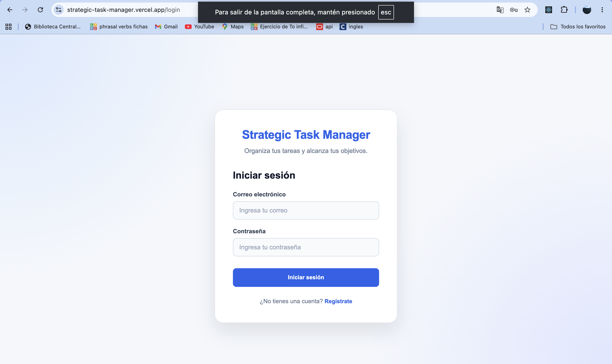
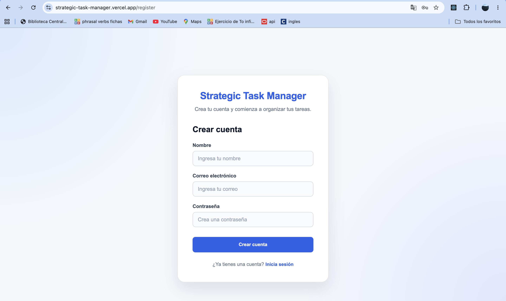
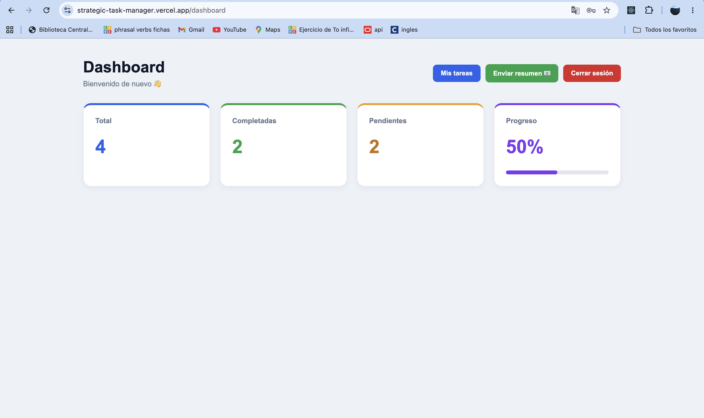
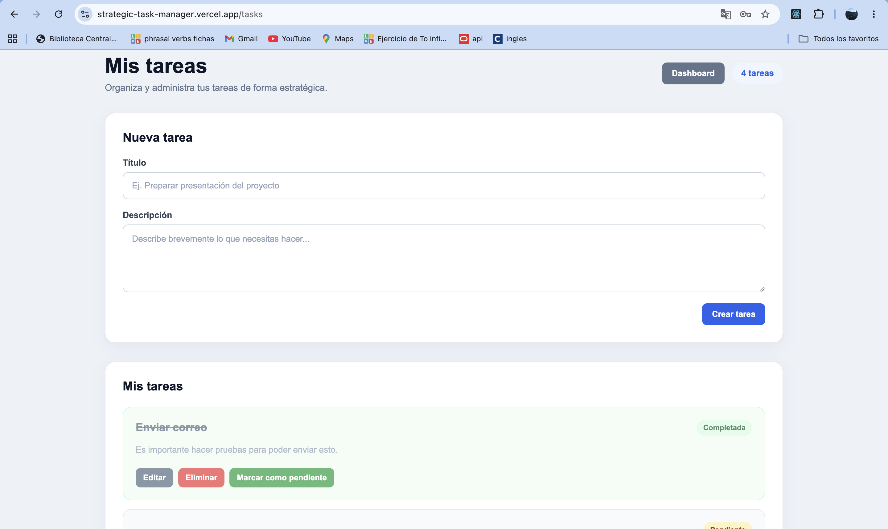
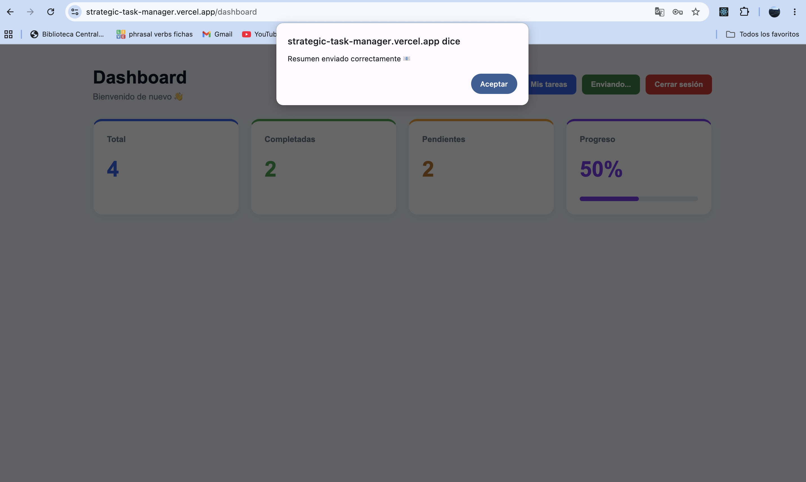
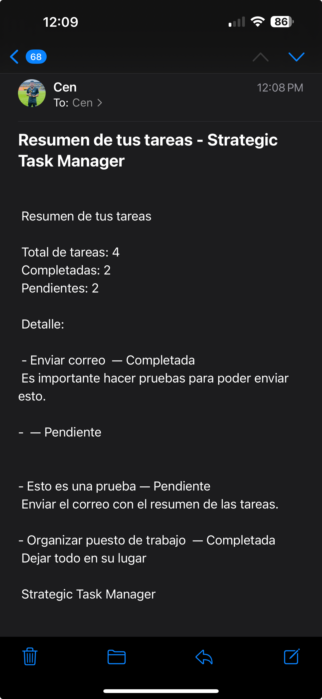

# Strategic Task Manager

Aplicación web SPA para la gestión estratégica de tareas. Permite a los usuarios registrarse, iniciar sesión, administrar sus tareas y consultar su progreso.

La información se almacena de forma persistente en Cloud Firestore y la aplicación permite enviar un resumen del estado de las tareas mediante AWS SES, utilizando una Vercel Function para mantener las credenciales sensibles fuera del frontend.

## 🚀 Aplicación en producción

**URL:** https://strategic-task-manager.vercel.app

## ✨ Funcionalidades

### 🔐 Autenticación

* Registro mediante correo electrónico y contraseña.
* Inicio de sesión.
* Cierre de sesión.
* Protección de rutas privadas.
* Manejo de errores de autenticación.
* Cada usuario tiene acceso únicamente a sus propias tareas.

### 📝 Gestión de tareas

Cada usuario puede:

* Crear tareas.
* Consultar sus propias tareas.
* Editar tareas.
* Eliminar tareas.
* Marcar tareas como completadas o pendientes.
* Consultar estadísticas de sus tareas.

### 📊 Dashboard

El dashboard muestra:

* Número total de tareas.
* Número de tareas completadas.
* Número de tareas pendientes.
* Porcentaje de progreso.
* Barra visual de progreso.

### 📧 Resumen por email

La aplicación permite enviar un resumen del estado de todas las tareas del usuario.

El flujo es:

```text
Frontend React
      ↓
POST /api/send-summary
      ↓
Vercel Function
      ↓
AWS SES
      ↓
Correo electrónico
```

Las credenciales de AWS no se exponen en el frontend. La función de Vercel utiliza variables de entorno para acceder a AWS SES.

> **Nota:** durante el desarrollo, AWS SES se encuentra en Sandbox. En este modo, AWS requiere que los destinatarios utilizados para las pruebas estén verificados. Para realizar envíos a destinatarios no verificados es necesario solicitar acceso de producción para Amazon SES.

---

# 👤 Usuario de prueba

Para facilitar la revisión de la aplicación se puede utilizar un usuario creado específicamente para realizar las pruebas.

**Correo:** `willy1323@hotmail.com`

**Contraseña:** `12345678`

Este usuario permite probar:

* Inicio de sesión.
* Creación de tareas.
* Edición de tareas.
* Eliminación de tareas.
* Marcar tareas como completadas.
* Dashboard.
* Envío del resumen por correo.

> Se recomienda utilizar una contraseña creada exclusivamente para este proyecto y no reutilizar una contraseña personal.

### 📧 Correo para probar AWS SES

Debido a que la cuenta utilizada para el proyecto se encuentra en **AWS SES Sandbox**, el correo utilizado como destinatario durante la demostración debe estar verificado previamente en AWS SES.

---

# 🛠️ Tecnologías utilizadas

## Frontend

* React
* TypeScript
* Vite
* React Router
* CSS

## Backend y servicios

* Firebase Authentication
* Cloud Firestore
* AWS SES
* Vercel Functions

## Testing

* Vitest
* React Testing Library
* Testing Library User Event
* jest-dom

## Herramientas

* Git
* GitHub
* Vercel
* ESLint

---

# 🏗️ Arquitectura

El proyecto utiliza una arquitectura basada en componentes y separación de responsabilidades.

La estructura principal es:

```text
src/
├── components/
│   ├── Button.tsx
│   ├── ProtectedRoute.tsx
│   ├── TaskForm.tsx
│   └── TaskItem.tsx
│
├── pages/
│   ├── DashboardPage.tsx
│   ├── LoginPage.tsx
│   ├── RegisterPage.tsx
│   └── TasksPage.tsx
│
├── services/
│   └── taskService.ts
│
├── styles/
│   ├── auth.css
│   ├── dashboard.css
│   ├── global.css
│   └── tasks.css
│
├── types/
│   └── Task.ts
│
└── test/
    └── setup.ts

api/
├── send-summary.ts
└── test.ts
```

## Separación de responsabilidades

Los componentes se encargan principalmente de la interfaz y del estado relacionado con la interacción del usuario.

La comunicación con Firestore se centraliza en:

```text
src/services/taskService.ts
```

Este servicio contiene las operaciones relacionadas con las tareas:

* `subscribeToUserTasks()` → lectura y sincronización de tareas.
* `createTask()` → creación de tareas.
* `updateTask()` → edición de tareas.
* `deleteTask()` → eliminación de tareas.
* `toggleTaskComplete()` → actualización del estado de completado.

Esto permite evitar que las páginas tengan que conocer directamente los detalles de implementación de Firestore y facilita el mantenimiento del proyecto.

---

# 🔥 Firebase

Firebase Authentication se utiliza para gestionar el registro, inicio y cierre de sesión de los usuarios.

Cloud Firestore se utiliza para almacenar las tareas.

Cada tarea contiene información relacionada con el usuario propietario:

```text
Task
├── id
├── title
├── description
├── userId
└── completed
```

Las tareas se consultan utilizando el `userId` del usuario autenticado.

Esto permite que cada usuario consulte únicamente sus propias tareas.

---

# 🔐 Seguridad y variables de entorno

Las variables sensibles no se almacenan directamente en el código fuente.

El proyecto utiliza variables de entorno para Firebase y AWS.

El archivo `.env.local` se utiliza durante el desarrollo y está excluido mediante `.gitignore`.

El archivo `.env.example` contiene únicamente los nombres de las variables necesarias:

```env
VITE_FIREBASE_API_KEY=
VITE_FIREBASE_AUTH_DOMAIN=
VITE_FIREBASE_PROJECT_ID=
VITE_FIREBASE_STORAGE_BUCKET=
VITE_FIREBASE_MESSAGING_SENDER_ID=
VITE_FIREBASE_APP_ID=
VITE_FIREBASE_MEASUREMENT_ID=

AWS_REGION=
AWS_ACCESS_KEY_ID=
AWS_SECRET_ACCESS_KEY=
SES_FROM_EMAIL=
```

### ⚠️ Importante

Las credenciales reales de AWS nunca deben subirse a GitHub.

No se incluyen en este repositorio:

* `AWS_ACCESS_KEY_ID` real.
* `AWS_SECRET_ACCESS_KEY` real.
* Contraseñas.
* Tokens.
* Valores privados del archivo `.env.local`.

Las credenciales de AWS se utilizan únicamente en la Vercel Function.

---

# 📧 Integración con AWS SES

El envío de emails se realiza mediante una función serverless de Vercel ubicada en:

```text
api/send-summary.ts
```

El frontend realiza una petición:

```text
POST /api/send-summary
```

En la petición se envían:

* Email destinatario.
* Lista de tareas.

La función procesa las tareas y genera un resumen que contiene:

* Total de tareas.
* Tareas completadas.
* Tareas pendientes.
* Detalle de cada tarea.

Posteriormente utiliza AWS SES para realizar el envío.

### Flujo completo

```text
Usuario autenticado
        ↓
Pulsa "Enviar resumen"
        ↓
React realiza POST
        ↓
Vercel Function
        ↓
Procesa las tareas
        ↓
AWS SES
        ↓
Correo recibido
```

Las credenciales de AWS permanecen en las variables de entorno del entorno serverless y nunca son enviadas al navegador.

---

# ⚠️ Limitación de AWS SES Sandbox

Durante el desarrollo, la cuenta utilizada para AWS SES se encuentra en **Sandbox**.

Esta configuración impone una restricción: los destinatarios utilizados durante las pruebas deben estar verificados en AWS SES.

Por esta razón, un usuario de Firebase puede registrarse normalmente con cualquier correo permitido por la aplicación, pero el envío del resumen puede ser rechazado por AWS SES si el destinatario no está verificado.

Para permitir envíos a destinatarios no verificados sería necesario solicitar a AWS el acceso de producción de Amazon SES.

Esta limitación corresponde a la configuración de AWS SES y no a Firebase Authentication.

---

# 📦 Instalación

Clonar el repositorio:

```bash
git clone <URL_DEL_REPOSITORIO>
cd strategic-task-manager
```

Instalar las dependencias:

```bash
npm install
```

Crear el archivo de variables de entorno:

```bash
cp .env.example .env.local
```

Completar las variables de Firebase y AWS con los valores correspondientes.

Ejecutar el proyecto:

```bash
npm run dev
```

---

# 🧪 Testing

El proyecto utiliza Vitest y React Testing Library para realizar pruebas unitarias y de componentes.

Actualmente se incluyen pruebas para `TaskForm` y `TaskItem`.

## TaskForm

Se comprueba:

* Renderizado del botón para crear una tarea.
* Renderizado del botón para guardar cambios cuando se está editando.

## TaskItem

Se comprueba:

* Renderizado del título y descripción.
* Ejecución de `onEdit`.
* Ejecución de `onDelete`.
* Ejecución de `onToggleComplete`.

Ejecutar los tests:

```bash
npm test -- --run
```

Resultado actual:

```text
Test Files  2 passed
Tests       6 passed
```

---

# 🔎 Validación del proyecto

## ESLint

Para comprobar posibles problemas de código:

```bash
npm run lint
```

## Build de producción

Para comprobar que el proyecto puede compilarse correctamente:

```bash
npm run build
```

El build actual se completa correctamente.

---

# 📜 Scripts disponibles

### Desarrollo

```bash
npm run dev
```

Inicia el servidor de desarrollo.

### Build

```bash
npm run build
```

Comprueba TypeScript y genera el build de producción.

### Preview

```bash
npm run preview
```

Permite visualizar localmente el build de producción.

### Lint

```bash
npm run lint
```

Ejecuta ESLint.

### Tests

```bash
npm test -- --run
```

Ejecuta los tests de Vitest.

---

# ☁️ Deploy

La aplicación está desplegada en Vercel.

URL de producción:

**https://strategic-task-manager.vercel.app**

Durante el despliegue se configuraron las variables de entorno necesarias para Firebase y AWS SES.

Las funciones serverless de Vercel se encuentran dentro de:

```text
api/
```

La función principal para el proyecto es:

```text
api/send-summary.ts
```

---

# 🖼️ Capturas de pantalla

Las siguientes capturas muestran las principales funcionalidades de la aplicación.

## Login



Pantalla de inicio de sesión de Strategic Task Manager.

## Registro



Formulario para crear una cuenta.

## Dashboard



Dashboard con estadísticas de tareas y progreso del usuario.

## Gestión de tareas



Vista para crear, editar, eliminar y completar tareas.

## Envío del resumen



Confirmación mostrada después de enviar correctamente el resumen.

## Correo recibido



Ejemplo del resumen recibido mediante AWS SES.

> Las imágenes son utilizadas como evidencia visual de las funcionalidades implementadas.

---

# 🤖 Uso de inteligencia artificial

La inteligencia artificial se utilizó como herramienta de apoyo durante el proceso de desarrollo, manteniendo como objetivo principal la comprensión del código y de las decisiones tomadas.

Se utilizó principalmente para:

* Comprender conceptos de React y TypeScript.
* Analizar errores de compilación.
* Resolver problemas relacionados con Firebase Authentication y Firestore.
* Comprender el funcionamiento de Vercel Functions.
* Integrar AWS SES de forma segura.
* Diseñar y mejorar la interfaz.
* Crear y comprender pruebas con Vitest y React Testing Library.
* Analizar errores encontrados durante el deploy.
* Refactorizar responsabilidades del código.
* Revisar la estructura y documentación del proyecto.

La IA se utilizó principalmente como apoyo para explicar conceptos, analizar errores y proponer alternativas. Las soluciones fueron revisadas e implementadas comprendiendo previamente su funcionamiento.

Una de las prácticas más útiles fue proporcionar a la IA los mensajes de error reales obtenidos durante el desarrollo. Esto permitió analizar problemas específicos relacionados con TypeScript, Vite, Firebase, AWS SES y Vercel.

También fue utilizada durante la refactorización de `TasksPage`, identificando la posibilidad de separar la lógica de persistencia de Firestore en `taskService.ts`.

Esta separación permitió mejorar la organización del proyecto y aplicar una mayor separación de responsabilidades.

## Buenas prácticas aprendidas mediante el uso de IA

Durante el desarrollo se identificaron varias prácticas importantes:

* No copiar código sin comprenderlo.
* Utilizar los mensajes de error como información para identificar la causa del problema.
* Mantener las credenciales fuera del código fuente.
* Separar la lógica de negocio de los componentes visuales.
* Utilizar TypeScript para reducir errores.
* Crear pruebas para componentes importantes.
* Validar el proyecto mediante build, lint y tests antes de realizar cambios importantes.
* Utilizar Git para mantener un historial de cambios organizado.

---

# 🧠 Decisiones arquitectónicas

## React + TypeScript

React permite construir una SPA mediante componentes reutilizables, mientras que TypeScript proporciona tipado estático para las estructuras de datos y las props.

## Firebase

Firebase Authentication se utiliza para gestionar la autenticación de usuarios.

Cloud Firestore se utiliza como base de datos para almacenar las tareas.

## Service Layer

Las operaciones de Firestore fueron separadas de las páginas mediante `taskService.ts`.

Esto evita mezclar la lógica de persistencia con la presentación de la interfaz y facilita futuras modificaciones.

## Vercel Functions + AWS SES

El envío de emails se realiza desde una función backend en Vercel.

Esta decisión permite mantener las credenciales de AWS fuera del frontend.

## Componentización

La aplicación utiliza componentes reutilizables como:

* `Button`
* `TaskForm`
* `TaskItem`
* `ProtectedRoute`

Esto facilita el mantenimiento y reduce la duplicación de código.

---

# 📋 Estado del proyecto

* [x] Registro de usuarios.
* [x] Login.
* [x] Logout.
* [x] Protección de rutas.
* [x] Crear tareas.
* [x] Listar tareas.
* [x] Editar tareas.
* [x] Eliminar tareas.
* [x] Marcar tareas como completadas.
* [x] Persistencia en Firestore.
* [x] Filtrado de tareas por usuario.
* [x] Dashboard.
* [x] Envío de resumen mediante AWS SES.
* [x] Vercel Function.
* [x] Variables de entorno.
* [x] Tests.
* [x] ESLint.
* [x] Build de producción.
* [x] Deploy en Vercel.
* [x] Documentación.
* [x] Documentación del uso de IA.

---

# # 👨‍💻 Autor

**Fabian Fonnegra - Ingeniero de Software**


**Strategic Task Manager**

Proyecto desarrollado como parte del Proyecto Integrador, aplicando React, TypeScript, Firebase, Firestore, AWS SES, Vercel, testing, Git y buenas prácticas de desarrollo.
